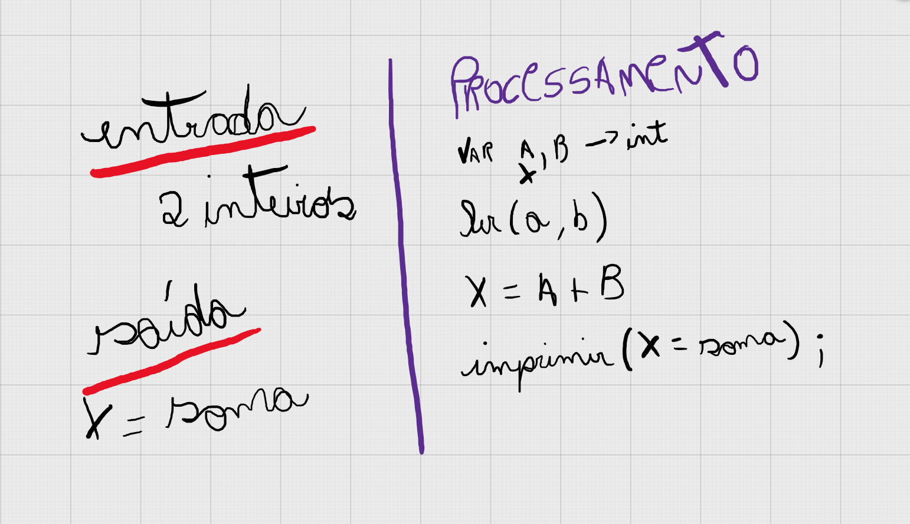

# 🤔 Como resolvi o problema 1001?

## Entendimento

1. Criei duas variáveis (A, B);
2. Fiz a leitura da entrada de dados dessas variáveis;
3. Criei a variável (X) já sendo inicializada recebendo a soma de ```A + B```;
4. Utilizei o ```console.log``` para "printar" a soma. No ```console.log``` usei Template Strings que são string que permitem expressões embutidas. Exemplo:
```texto string ${expression} texto string```

## Solução



[Resolução do problema // Código Javascript](../../1001.js)