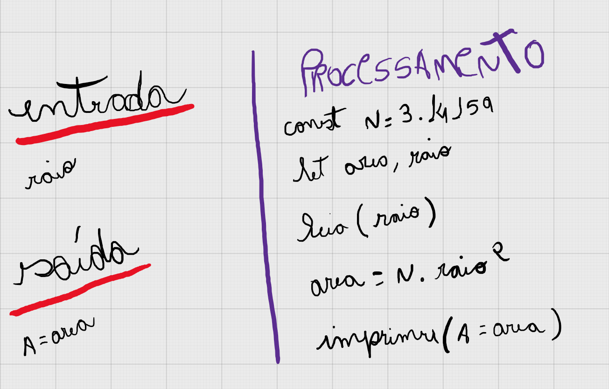

# 🤔 Como resolvi o problema 1002?

## Entendimento

1. Criar uma constante para armazenar o valor de n.
    - Porque uma constante? A constante foi escolhida nesse caso pois é "n" um valor que não se altera ao longo do nosso algoritmo.
2. Criação das variáveis para realizar o cálculo da área, ao qual o problema já nos fornece a fórmula.
3. Agora precisamos transformar essa fórmula matemática em algo que o computador entenda.
    - Para isso, utilizaremos uma função chamada [```Math.pow()```](https://developer.mozilla.org/pt-BR/docs/Web/JavaScript/Reference/Global_Objects/Math/pow) que retorna a base elevado ao expoente.
    - O cálculo da área ficaria da seguinte forma: ```area = n * Math.pow(raio, 2);```
4. Por fim, precisamos mostrar o nosso resultado.
    - Um ponto importante nesse momento, o URI nos pede para mostrar 4 casas após o ponto decimal.
    - Para fazermos isso, usaremos o método [```toFixed()```](https://developer.mozilla.org/pt-BR/docs/Web/JavaScript/Reference/Global_Objects/Number/toFixed) que formata um número utilizando notação de ponto fixo.

## Solução



[Resolução do problema // Código Javascript](../../1002.js)