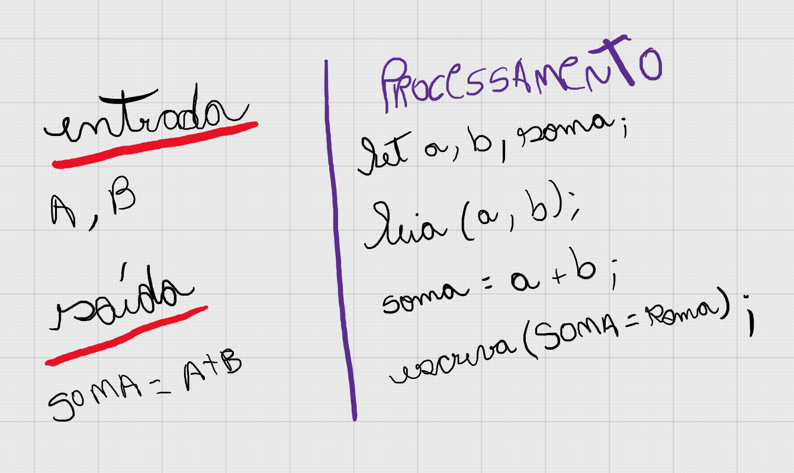

# 🤔 Como resolvi o problema 1003?

## Entendimento

1. Criei as duas variáveis: a, b. Essas serão as variáveis que receberão os dados de entrada da pessoa usuária.
2. Após o recebimento da entrada de dados, criei uma constante chamada "soma" que recebe a soma das variáveis a e b.
3. Por fim, mostramos o resultado da soma com o ```console.log```.

## Solução



[Resolução do problema // Código Javascript](../../1003.js)