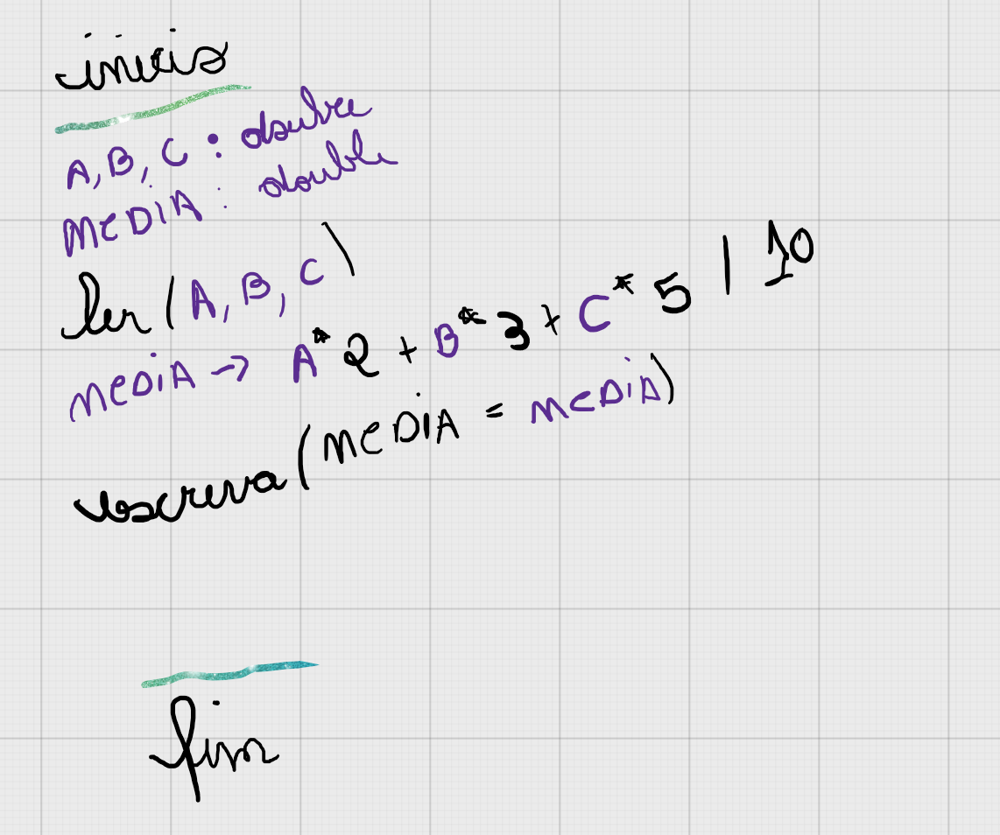

# 🤔 Como resolvi o problema 1006?

## Entendimento

1. Ler três variáveis, denominadas A, B e C.
2. Criar uma variável que irá receber o cálculo da média.
3. Apresentar a média.

## Solução

[Resolução do problema // Código Javascript](../../1006.js)