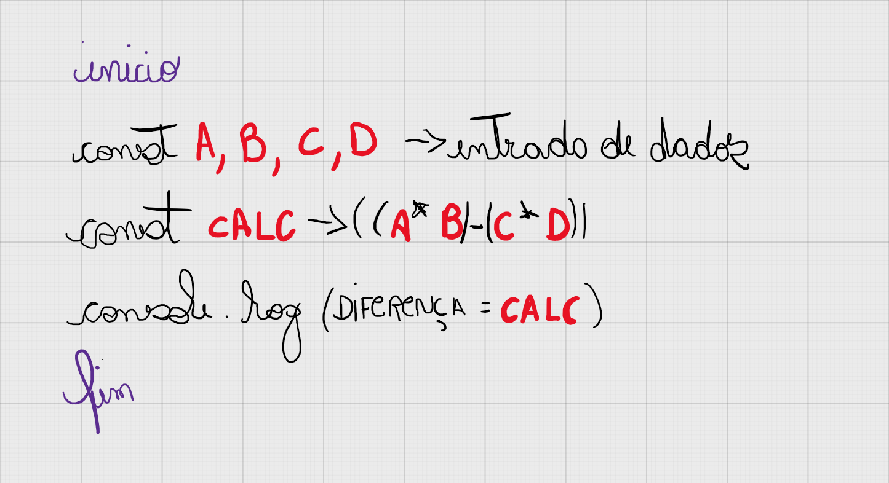

# 🤔 Como resolvi o problema 1007?

## Entendimento

1. Precisamos ter 4 variáveis: A, B, C e D.
2. Ler a entrada de dados da pessoa usuária e armazenar nestas variáveis.
2. Realizar os cálculos e armazenar em uma variável auxiliar.
3. Mostramos a saída de dados na tela com "DIFERENCA = ```resultado```".

## Solução



[Resolução do problema // Código Javascript](../../1007.js)