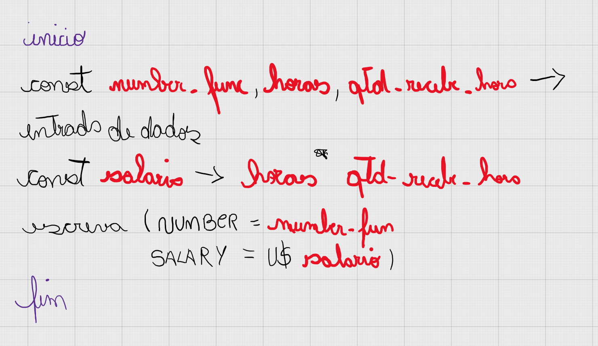

# 🤔 Como resolvi o problema 1008?

## Entendimento

1. Criação de três variáveis que irão receber a entrada de dados do funcionário. Sendo elas, número do funcionario, horas trabalhadas e quanto recebe por hora.
2. Precisaremos de uma variável para armazenar o cálculo do salário.
3. Para cálcular o salário: horas trabalhadas * quanto recebe por hora.
4. Por fim, apresentaremos o resultado na tela para a pessoa usuária. Na saída, teremos ```número do funcionario e salario```.

## Solução



[Resolução do problema // Código Javascript](../../1008.js)