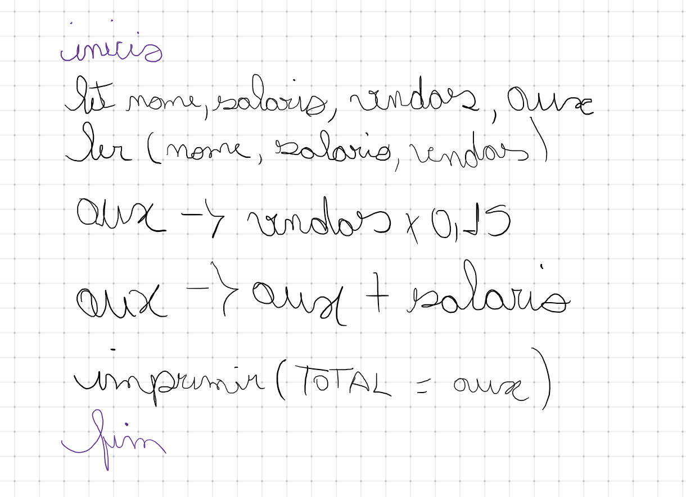

# 🤔 Como resolvi o problema 1008?

## Entendimento

1. Iremos precisar de três variáveis para armazenar o nome do vendedor, seu salário e as vendas em dinheiro.

    - nome (string)
    - salario (double)
    - vendas (double)

2. Receber a entrada de dados e armazenar nas variáveis criadas no passo 1.

3. Calcular os 15% sobre as suas vendas e armazenar em uma variável auxiliar.

 - Para calcular a porcentagem precisamos pegar o valor da porcentagem dividido pelo valor desejado e depois multiplicamos pelo mesmo valor.

 - aux (double)

 4. Somamos o salário fixo do vendedor mais a comissão sobre as suas vendas e armazenar na variável criada no passo 3.

 5. Por fim, imprimimos o resultado do total que o vendedor vai receber no mês.

## Solução

[Resolução do problema // Código Javascript](../../1009.js)