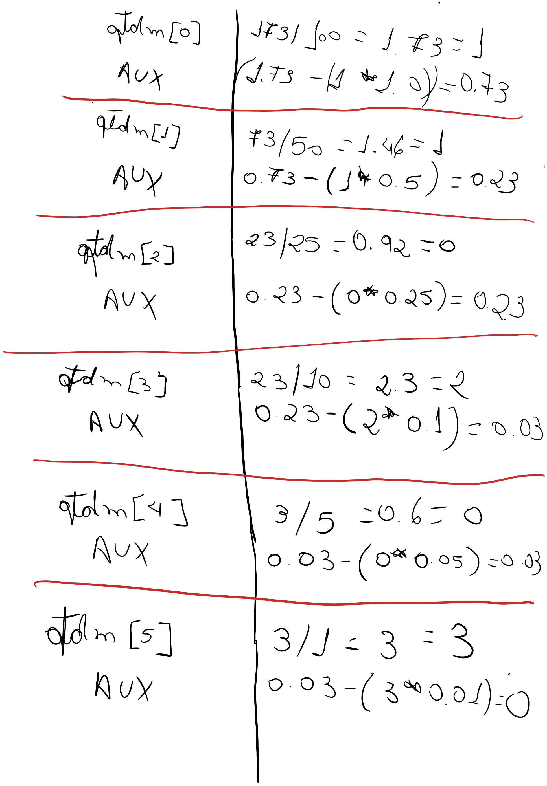

# 🤔 Como resolvi o problema 1021?

## Entendimento

1. Criar uma variável para armazenar um valor de ponto flutuante da entrada de dados.

2. Cálculo para notas e moedas
    - Precisaremos de uma variável auxiliar;
    - Dois vetores, um referente as notas e outro referente as moedas;
    - Usaremos um laço for para percorrer o vetor, utilizando a variável auxiliar para fazer a subtração do valor total.

> Uma informação MUITO importante sobre esse problema e um ensinamento para a vida, trabalhe SEMPRE QUE POSSIVEL com números inteiros.
    
    - Então, para que todos os cálculos funcionem corretamente como o esperado vamos trabalhar apenas com números inteiros nesse problema.
    - Para isso, vamos multiplicar todos os valores que iremos trabalhar por 100 e no fim, no momento de imprimir a saída dividiremos por 100 novamente.

### Teste de mesa

## Solução

[Resolução do problema // Código Javascript](../../1021.js)
